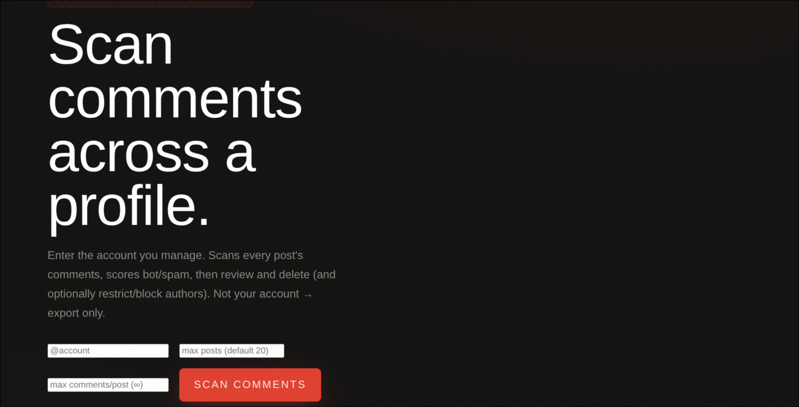
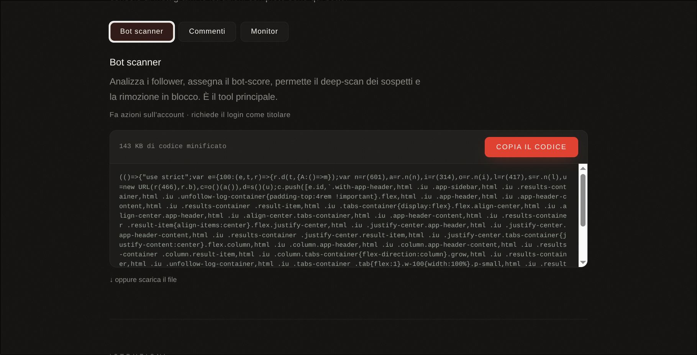

# BotScraper

A fork of [davidarroyo1234/InstagramUnfollowers](https://github.com/davidarroyo1234/InstagramUnfollowers)
that grows the original tool from "who doesn't follow me back" into a **follower and comment
analysis suite** for accounts you manage.

Like the original, it runs entirely in your browser: you paste the script into the console
on a logged-in instagram.com, it uses your current session, and **no data ever leaves your
machine**. Nothing to install, no server in the middle.

> ⚠️ Only use this on accounts you manage **with authorization**. Removing followers and
> deleting comments cannot be undone.

---

## What it adds on top of upstream

Upstream answers one question: who doesn't follow you back. BotScraper adds:

- **Bot score 0–100** for every follower, derived from the basic fields that already come
  with the list (username, full name, profile picture, private flag). Verified accounts and
  mutuals are always excluded.
- **Deep scan**, optional and limited to flagged candidates: follower/following ratio,
  post count, recently created accounts (`is_joined_recently`), bio.
- **Bulk removal** through `remove_follower`, with delays that keep you under the radar.
- **Comment scraping and scoring** across every post of an account, with deletion and
  optional actions on the author (restrict / block / remove).
- **Read-only monitor**: lead discovery and client tracking, with a HOT/WARM/COLD table.
- **Account health report**: health score, estimated bot followers, risk flags and a
  recommended action.
- **Removal lists** you can export and re-import, with live re-verification.

## The three tools

| Tool | What it does | Entry point | Bundle |
|---|---|---|---|
| **Bot scanner** | Scores followers, deep-scans suspects, removes in bulk | `src/main.tsx` | `dist/dist.js` |
| **Comments** | Bot/spam score on every post's comments, then delete | `src/main-comments.tsx` | `dist/comments.js` |
| **Monitor** | Leads and account tracking over time — **read-only** | `src/main-monitor.tsx` | `dist/monitor.js` |

Only the Monitor performs no actions on Instagram. The other two act on the account, so
they need you logged in **as** its owner.

Each tool opens on a start screen where you set the scan parameters. The comment scanner,
for instance, asks for the account plus two limits — how many posts to walk back and how
many comments to read per post — so you can keep the scan short on profiles with a long
history:



If the target account isn't the one you're logged in as, the tool tells you and asks for
confirmation before starting; from there it continues in **scan-and-export mode**, with
every deletion action disabled.

## How to use it

The ready-to-paste code lives at **<https://chris1sflaggin.it/botscraper/>** — pick a tool
and hit *Copia il codice* (copy the code).



Then:

1. Open **instagram.com** and log in as the account you want to analyze.
2. Open the browser console — `Ctrl + Shift + J` on Windows and Linux, `⌘ + ⌥ + I` on macOS.
3. Paste the code and hit Enter. If Chrome asks you to type `allow pasting` first, do it:
   it's a browser safeguard and you only have to type it once.
4. The interface appears on top of Instagram: hit **RUN** and let the scan finish.

Alternatively, build the bundles yourself with `npm run build` and paste the contents
of `dist/`.

### Before you start

Instagram changes its internal APIs often, and when it does the tool stops working until
it's updated. The check that tells you straight away whether you're good to go is on the
page linked above — it takes two seconds, run it every time.

## How the bot score works

The score is an **estimate built on public signals, not a verdict**. Reviewing the list
before removing anyone is part of the flow, not an optional extra:

1. **Scan** — score every follower from the data that already ships with the list.
2. **Deep scan** — only candidates above the threshold get their profile fetched, which
   keeps the request count low and the rate limiter happy.
3. **Review** — the list is sorted by score; move the threshold, check the results, and
   whitelist the false positives. The whitelist persists across sessions.
4. **Removal** — in bulk, with pauses between actions.

New accounts, accounts without a profile picture, accounts with few posts: none of these
are bots by themselves. They're just the traits bots most often share.

## Development

- Node 16.14.0 (`nvm use`)
- `npm run build` — builds the three bundles and refreshes the HTML in `public/`
- `npm test` — vitest

## Staying in sync with upstream

The repo is wired to the original, so updates come down the usual way:

```sh
git fetch upstream
git merge upstream/master
```

The fork point is upstream commit `1b840ec` (June 7, 2026). The shared ancestry was
established with a one-off merge, because this history started life as a squashed
snapshot with no common ancestor.

## License and credits

Based on [InstagramUnfollowers](https://github.com/davidarroyo1234/InstagramUnfollowers)
by **David Arroyo**, released under the MIT License. The original copyright is preserved
in [LICENSE](LICENSE), and this fork stays under the same MIT terms.

**Disclaimer:** this tool is not affiliated, associated, authorized, endorsed by, or in
any way officially connected with Instagram. Use at your own risk.
